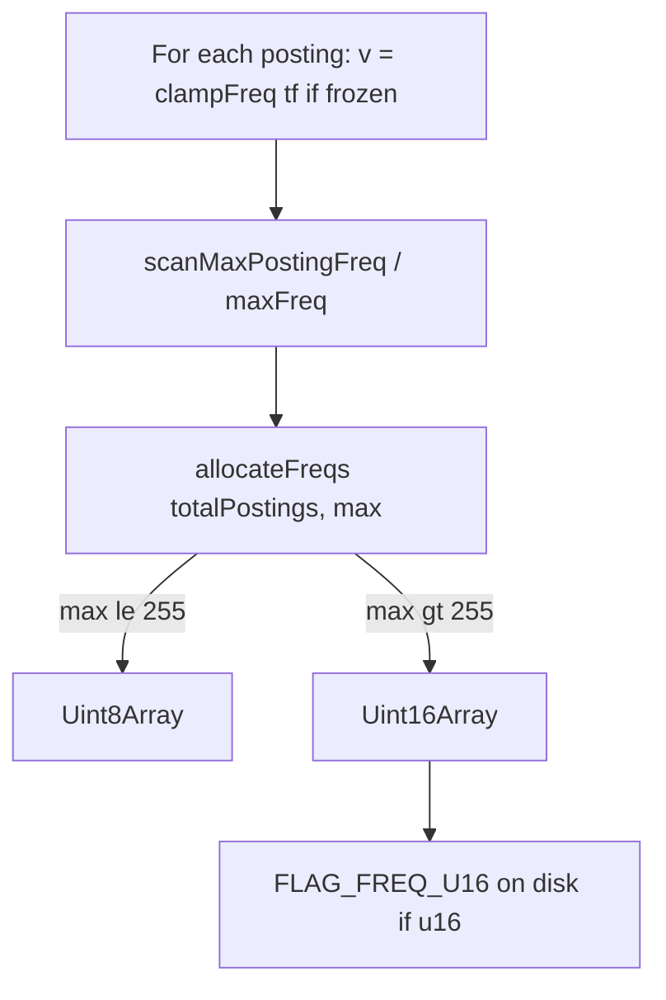

# Recap — adaptive posting frequencies (u8 / u16)

Review document for the "freq adaptive" change on `FrozenMiniSearch`.  
Package: `@yoch/frozenminisearch` 1.x.

---

## 1. Context and objective

**Before**: the global `allFreqs` column was always a `Uint8Array`, with `clampFreq` capped at **255**. Consequence: BM25 parity was broken whenever a term exceeds 255 occurrences in a field-document (`scoreDrift` ~**0.2 %** on the `extreme-overflowFrequency` scenario).

**After**: **adaptive** width `Uint8Array` | `Uint16Array`, cap type **u16** (no u32), clamp at **65535** on all frozen paths (`clampFrequencies: true`).

Goal: fix the artificial 255 limit **without** doubling the freqs column on typical corpora (Divina, large vocabulary, etc.).

---

## 2. Chosen parameters (invariants)

| Parameter | Value |
|-----------|--------|
| `MAX_FREQ` | `65535` — [`src/compactPostings.ts`](../../src/compactPostings.ts) |
| `allFreqs` type | `FreqArray = Uint8Array \| Uint16Array` |
| u8 allocation threshold | `maxAfterClamp ≤ 255` → `Uint8Array`, otherwise `Uint16Array` |
| Cap type | **never** `Uint32` for posting frequencies |
| Clamp frozen | `clampFrequencies: true` — [`src/FrozenMiniSearch.ts`](../../src/FrozenMiniSearch.ts), [`src/frozenBuild.ts`](../../src/frozenBuild.ts) |
| Wire flag | `FLAG_FREQ_U16 = 32` — [`src/msv5/binaryMsv5Constants.ts`](../../src/msv5/binaryMsv5Constants.ts) |
| Backward compat | flag absent → `AllFreqs` section read as u8 (existing snapshots) |
| Old binaries | rejected; re-save with `saveBinarySync()` |

```typescript
// src/compactPostings.ts
export const MAX_FREQ = 65535

export function clampFreq(freq: number): number {
  return freq > MAX_FREQ ? MAX_FREQ : freq
}

export function allocateFreqs(length: number, maxValue: number): FreqArray {
  if (maxValue <= 0xff) return new Uint8Array(length)
  return new Uint16Array(length)
}
```

---

## 3. Build flow



- **Build**: [`src/incrementalPostings.ts`](../../src/incrementalPostings.ts) — append once, then finalize into dense/sparse typed buffers.
- **Layout/runtime**: [`src/frozenPostings.ts`](../../src/frozenPostings.ts) — layout choice, storage shape, and query-time access.
- **Search**: [`SegmentPostingList`](../../src/compactPostings.ts) reads `freqs[i]` without a width branch in the BM25 loop ([`src/scoring.ts`](../../src/scoring.ts)).

---

## 4. Modified / added files

### New

| File | Role |
|---------|------|
| [`src/freqPostings.ts`](../../src/freqPostings.ts) | `freqWireFlags`, `readFreqsSection` |
| [`benchmarks/scripts/freq-adaptive-validate.mjs`](../../benchmarks/scripts/freq-adaptive-validate.mjs) | Smoke validation ~20 s (3 scenarios) |

### Runtime code

| File | Changes |
|---------|-------------|
| [`src/compactPostings.ts`](../../src/compactPostings.ts) | `MAX_FREQ`, `FreqArray`, `allocateFreqs`, `clampFreq(65535)`, `SegmentPostingList.freqs: FreqArray` |
| [`src/incrementalPostings.ts`](../../src/incrementalPostings.ts) | `GrowableFreqColumn`, clamp on append, finalize into contiguous `allFreqs: FreqArray` |
| [`src/frozenPostings.ts`](../../src/frozenPostings.ts) | `FrozenPostingsLayout.allFreqs: FreqArray`, pass 1 metadata+count+max, pass 2 write (sparse) |
| [`src/msv5/binaryMsv5Constants.ts`](../../src/msv5/binaryMsv5Constants.ts) | `FLAG_FREQ_U16 = 32` |
| [`src/msv5/binaryMsv5Encode.ts`](../../src/msv5/binaryMsv5Encode.ts) | `globalFlags \|= freqWireFlags(snap.postings.allFreqs)` (sync + async) |
| [`src/msv5/binaryMsv5Postings.ts`](../../src/msv5/binaryMsv5Postings.ts) | `readFreqsSection(freqs, flags, allDocIds.length)` |

### Unchanged (intentionally)

| File | Reason |
|---------|--------|
| [`src/binaryDecode.ts`](../../src/binaryDecode.ts) | current binary format only |
| [`src/scoring.ts`](../../src/scoring.ts) | BM25+ formula unchanged |

### Tests

| File | Coverage |
|---------|------------|
| [`src/FrozenMiniSearch.test.js`](../../src/FrozenMiniSearch.test.js) | `allFreqs adaptive width` block: typical u8, u16 overflow, mutable parity, binary round-trip |
| [`src/msv5/binaryMsv5.test.js`](../../src/msv5/binaryMsv5.test.js) | `FLAG_FREQ_U16` present (overflow) / absent (standard corpus) |

### Documentation updated

- [`README.md`](../../README.md)
- [`DESIGN_DOCUMENT.md`](../../DESIGN_DOCUMENT.md)
- [`CHANGELOG.md`](../../CHANGELOG.md) (Unreleased section)
- [`ANALYSE_STRATEGIE_PACKAGE.md`](../../ANALYSE_STRATEGIE_PACKAGE.md)
- [`benchmarks/README.md`](../../benchmarks/README.md)

### Baseline (`reference.json`)

**`extreme-overflowFrequency`** scenario only (manual patch, no full suite re-record):

| Field | Before | After |
|-------|-------|-------|
| `postings.allFreqsBytes` | 6 000 | **12 000** |
| `postings.totalTypedBytes` | 18 032 | **24 032** |
| `estimatedStructuredBytes` | 20 102 | **26 102** |
| `scoreDrift[0].maxRelScoreDeltaPct` | 0.2 | **0** |
| `scoreDrift[0].maxAbsScoreDelta` | 0.000001 | **0** |

---

## 5. Wire (binary snapshot)

- Section unchanged: `Msv5SectionId.AllFreqs` (index 11).
- **Encode**: `bufferFromView(postings.allFreqs)`; global bit `FLAG_FREQ_U16` if `Uint16Array`.
- **Decode**: `readFreqsSection` — validation `buf.length === postingCount` (u8) or `=== postingCount × 2` (u16).
- **Coexisting global flags** (16 bits, header offset 6):

| Bit | Constant | Usage |
|-----|-----------|--------|
| 1 | `FLAG_DOC_ID_16` | doc ids u16 |
| 2 | `FLAG_SPARSE_LAYOUT` | sparse postings |
| 4 | `FLAG_FIELD_ID_16` | sparse field ids u16 |
| 8 | `FLAG_FL_U8` | fieldLengthMatrix u8 |
| 16 | `FLAG_FL_U16` | fieldLengthMatrix u16 |
| **32** | **`FLAG_FREQ_U16`** | **allFreqs u16** |

Absence of `FLAG_FREQ_U16` = freqs section u8 (backward compat with existing snapshots).

---

## 6. Benchmark scripts — parameters and durations

### 6.1 New scripts (added for this change)

| npm script | Command | Default parameters | Scenarios | Observed duration* |
|------------|----------|----------------------|-----------|-----------------|
| `pnpm benchmark:validate:freq-adaptive` | `node --expose-gc benchmarks/scripts/freq-adaptive-validate.mjs` | `RUNS=1`, `SEARCH_ITERATIONS=10`, `BENCH_WARMUP=15` (env in `package.json`); prefix `pnpm build` | 3: `divina-storeFields`, `extreme-overflowFrequency`, `extreme-giantVocabulary` | **~35–40 s** measurement; **~50 s** with build |
| `pnpm benchmark:record:quick` | `captureBaseline.js` | `RUNS=1`, `SEARCH_ITERATIONS=10`, `BENCH_WARMUP=20` | 13 (full suite) | Several minutes (vs standard `benchmark:record` **very long**) |

\* Dev machine at implementation time (Node 24, `--expose-gc`). Structural smoke timings **do not fail** the script.

#### Timing details `validate:freq-adaptive` (observed run)

| Scenario | Wall duration | Functional result |
|----------|------------|----------------------|
| `divina-storeFields` | **2.8–2.9 s** | `allFreqsBytes` 98 836 (= ref); heap frozen ~1.68 MB (ref 1.65) |
| `extreme-overflowFrequency` | **2.7 s** | `allFreqsBytes` 12 000; `scoreDrift` **0 %** |
| `extreme-giantVocabulary` | **13–14 s** | `allFreqsBytes` 200 000 (= ref); heap ~2.29 MB |
| **Total** | **~20 s** | exit 0 — `freq-adaptive validation OK` |

#### Gating criteria (`freq-adaptive-validate.mjs`)

**FAIL (exit 1)**:

- heap frozen +10 % compared to ref (outside floor rules)
- `allFreqsBytes` +2 % on standard corpus (divina, giant vocab)
- overflow without expected u16 growth
- `scoreDrift.maxRelScoreDeltaPct` > **0.05 %**

**Log only (non-blocking)**:

- `freezeMs`, `saveBinaryMs`, `loadBinaryMs`
- search frozen p50 per query (1 run vs reference median 3 runs)

**Heap floor thresholds** ([`benchmarks/regressionPolicy.js`](../../benchmarks/regressionPolicy.js)):

- `HEAP_MB_FLOOR` = 0.05 MB
- +256 KB absolute → fail; +128 KB → warn

**Overrides**: `RUNS=2 SEARCH_ITERATIONS=10 pnpm benchmark:validate:freq-adaptive`

---

### 6.2 Standard suite (existing)

| Script | Default parameters | Aggregation | Profile |
|--------|-------------------|------------|--------|
| `pnpm benchmark:record` | `RUNS=3`, `SEARCH_ITERATIONS=15`, `BENCH_WARMUP=100` | median over 3 runs | `full` |
| `pnpm benchmark:record:search` | same + `BENCH_SEARCH_ONLY=1` | median | `search` (no index/heap/save/load timing) |
| `pnpm benchmark:diff` | reads `latest.json` vs `reference.json` | — | no re-run |
| `pnpm benchmark:diff:run` | record + diff | — | |
| `pnpm benchmark:baseline:update` | record → `reference.json` (clean git) | — | |
| `pnpm benchmark:targeted` | defaults `benchmarkUtils`; `--runs` CLI | median if runs>1 | 7 scenarios |
| `pnpm benchmark:compare` | 3×15 via `compare.js` | — | readable report |

**Search protocol** ([`benchmarks/baselines/reference.json`](../../benchmarks/baselines/reference.json)):

- `searchBenchProtocol` v1: `batchTargetMs` 0.3; `maxBatch` 32
- Fixed batches: [`benchmarks/searchBenchBatches.json`](../../benchmarks/searchBenchBatches.json)
- Reference captured: **2026-06-03**, commit `6278ba1`, Node **v22.22.0**, `runs=3`, `searchIterations=25`

**`benchmark:diff` thresholds**:

| Metric | Fail | Warn |
|----------|------|------|
| heap frozen | +10 % | +5 % |
| heap saving vs mutable | −10 pts | −5 pts |
| loadBinary | +20 % | +10 % |
| freezeMs | +40 % | +20 % |
| saveBinaryMs | +30 % | +15 % |
| search p50 | +50 % (except `--strict`) | +20 % |

Floor rules (< 10 ms structural, < 0.1 ms search): see [`regressionPolicy.js`](../../benchmarks/regressionPolicy.js).

---

### 6.3 `benchmark:targeted` (7 scenarios)

IDs: `extreme-giantVocabulary`, `extreme-overflowFrequency`, `denseNumericIds-100k`, `genericStringIds-100k`, `docIdUint16Boundary-65535`, `docIdUint16Boundary-65536`, `saveBinaryAfterNoTerms`.

Before/after comparison:

```bash
pnpm benchmark:targeted --label before --out /tmp/before.json
pnpm benchmark:targeted --label after --out /tmp/after.json
pnpm benchmark:targeted:compare --compare=/tmp/before.json,/tmp/after.json
```

Exit 1 if **after** regresses vs **before** on freeze / saveBinary / loadBinary.

---

## 7. Full current baseline analysis (`reference.json`)

13 scenarios, **full** profile, median **3×25** (golden reference captured that way); default `benchmark:record` routine = **3×15** since this change. Post-change frequency synthesis (only **overflow** modified in the golden).

| Scenario | Docs | heap frozen (MB) | saving % | allFreqsBytes | search gain p50 avg | scoreDrift | Freq adaptive impact |
|----------|------|------------------|----------|---------------|---------------------|------------|----------------------|
| `divina-storeFields` | 14 097 | 1.65 | 89.8 | 98 836 | +26.6 % | — | u8 unchanged |
| `divina-indexOnly` | 14 097 | 0.925 | 93.8 | 98 836 | +15.7 % | — | u8 unchanged |
| `extreme-giantVocabulary` | 50 000 | 2.294 | 95.1 | 200 000 | +27.2 % | — | u8 unchanged |
| `extreme-largeDocuments` | 5 000 | 0.501 | 92.4 | 45 000 | +31.7 % | — | u8 |
| `extreme-manyFields` | 2 000 | 0.097 | 98.6 | 80 000 | +57.0 % | — | u8 |
| `extreme-highFrequency` | 10 000 | 0.165 | 97.8 | 100 000 | +42.5 % | — | u8 (high tf but ≤255) |
| **`extreme-overflowFrequency`** | 2 000 | 0.201 | 63.4 | **12 000** (↑) | +40.9 % | **0 %** (was 0.2 %) | **u16**; mutable parity |
| `denseNumericIds-100k` | 100 000 | 4.612 | 94.9 | 300 000 | +48.1 % | — | u8 |
| `genericStringIds-100k` | 100 000 | 4.613 | 94.9 | 300 000 | +54.6 % | — | u8 |
| `sparseFields-50kTerms-20Fields` | 5 000 | 0.239 | 95.4 | 15 000 | +45.6 % | — | u8 |
| `docIdUint16Boundary-65535` | 65 535 | 3.004 | 94.9 | 262 140 | +40.7 % | — | u8 |
| `docIdUint16Boundary-65536` | 65 536 | 3.004 | 94.9 | 262 144 | +41.0 % | — | u8 |
| `saveBinaryAfterNoTerms` | 50 000 | 2.293 | 95.1 | 200 000 | +12.1 % | — | u8 |

### Global reading

- **12/13 scenarios**: `allFreqsBytes` **identical** to before the change (max tf ≤ 255).
- **1/13** (`overflow`): freqs column **×2** (6 000 → 12 000 bytes); `estimatedStructuredBytes` +6 KB; **BM25 parity** restored.
- **Divina**: freqs ≈ **24 %** of `totalTypedBytes` postings (~99 KB / ~404 KB); ~**6 %** of heap frozen (excluding storedFields JSON) — justification of adaptive mode vs fixed u16 everywhere.
- **Reference not re-recorded** as full suite: only overflow patched; index/search timings remain from commit `6278ba1`.

### Smoke validation vs ref (observed run)

- Functional metrics: **OK**
- Structural timings: often marked FAIL in log on 1 run (noise) — **non-blocking** by design
- **Recommendation**: `pnpm benchmark:validate:freq-adaptive` to validate this feature; `pnpm benchmark:record` (3×15) for releases / intentional `baseline:update`

---

## 8. Out of scope (not done)

- Fixed Uint16 for all indexes
- `Uint32` for posting frequencies
- Dedicated new wire revision (extension via flags suffices)
- Vbyte / delta encoding
- Re-save required for obsolete binary snapshots

---

## 9. Suggested review points

1. **Double pass** build postings (dense and sparse): count+max then write — acceptable vs tokenization?
2. **Sparse invariant**: field ids sorted per term (ascending `f` loop) — unchanged by count+max merge.
3. **Clamp 65535**: not benchmarked on `repeat > 65535` (optional future).
4. **Baseline**: only overflow patched; no full suite re-record after the change.

---

## Useful commands

```bash
# Quick validation of this change (~20 s after build)
pnpm benchmark:validate:freq-adaptive

# Accelerated full suite (several minutes)
pnpm benchmark:record:quick

# Full golden suite (long — releases only)
pnpm benchmark:record
pnpm benchmark:diff

# Unit tests
pnpm test
```
