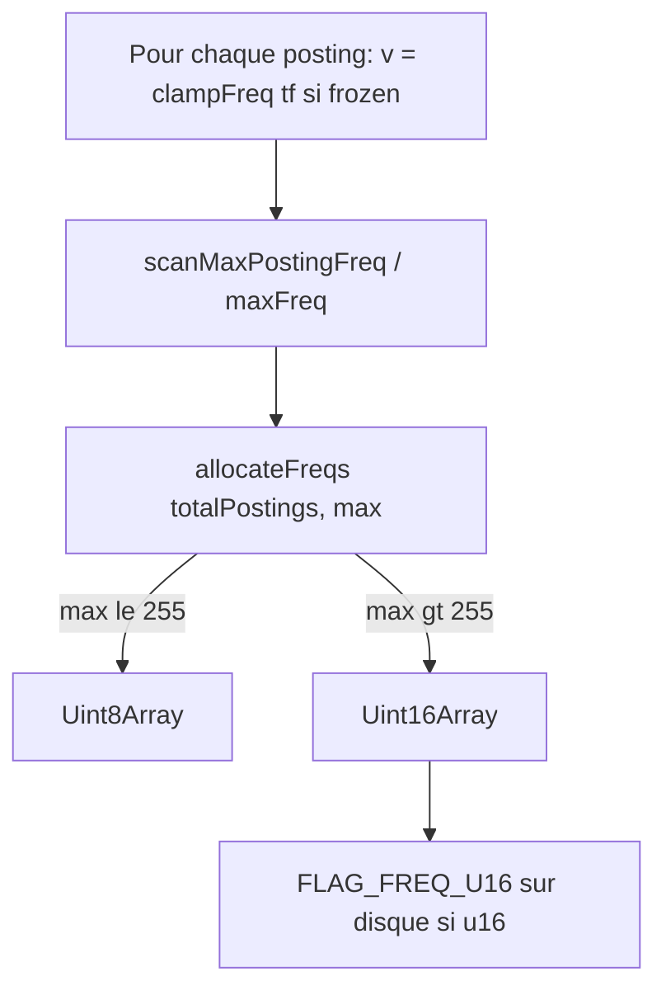

# Récapitulatif — fréquences postings adaptatives (u8 / u16)

Document de relecture pour le changement « freq adaptive » sur `FrozenMiniSearch`.  
Package : `@yoch/minisearch` 8.4.0-beta.0.

---

## 1. Contexte et objectif

**Avant** : la colonne globale `allFreqs` était toujours un `Uint8Array`, avec `clampFreq` plafonné à **255**. Conséquence : parité BM25 cassée dès qu’un terme dépasse 255 occurrences dans un champ-document (`scoreDrift` ~**0,2 %** sur le scénario `extreme-overflowFrequency`).

**Après** : largeur **adaptative** `Uint8Array` | `Uint16Array`, plafond de type **u16** (pas de u32), clamp à **65535** sur tous les chemins frozen (`clampFrequencies: true`).

Objectif : corriger la limite artificielle à 255 **sans** doubler la colonne freqs sur les corpus typiques (Divina, vocabulaire large, etc.).

---

## 2. Paramètres retenus (invariants)

| Paramètre | Valeur |
|-----------|--------|
| `MAX_FREQ` | `65535` — [`src/compactPostings.ts`](../src/compactPostings.ts) |
| Type `allFreqs` | `FreqArray = Uint8Array \| Uint16Array` |
| Seuil allocation u8 | `maxAfterClamp ≤ 255` → `Uint8Array`, sinon `Uint16Array` |
| Plafond type | **jamais** `Uint32` pour les fréquences de postings |
| Clamp frozen | `clampFrequencies: true` — [`src/FrozenMiniSearch.ts`](../src/FrozenMiniSearch.ts), [`src/frozenBuild.ts`](../src/frozenBuild.ts) |
| Flag MSv5 | `FLAG_FREQ_U16 = 32` — [`src/msv5/binaryMsv5Constants.ts`](../src/msv5/binaryMsv5Constants.ts) |
| Rétrocompat MSv5 | flag absent → section `AllFreqs` lue en u8 (snapshots existants) |
| Legacy MSv3/MSv4 | decode u8 inchangé ; limite 255 tant que non re-sauvegardé en MSv5 |

```typescript
// src/compactPostings.ts
export const MAX_FREQ = 65535

export function clampFreq(freq: number): number {
  return freq > MAX_FREQ ? MAX_FREQ : freq
}

export function allocateFreqs(length: number, maxValue: number): FreqArray {
  if (maxValue <= 0xff) return new Uint8Array(length)
  return new Uint16Array(length)
}
```

---

## 3. Flux build



- **Dense** : [`src/flatPostings.ts`](../src/flatPostings.ts) — 3 passes (count postings, scan max, write).
- **Sparse** : [`src/frozenPostings.ts`](../src/frozenPostings.ts) — même logique (scan max avant allocation, puis write).
- **Recherche** : [`SegmentPostingList`](../src/compactPostings.ts) lit `freqs[i]` sans branche de largeur dans la boucle BM25 ([`src/scoring.ts`](../src/scoring.ts)).

---

## 4. Fichiers modifiés / ajoutés

### Nouveaux

| Fichier | Rôle |
|---------|------|
| [`src/freqPostings.ts`](../src/freqPostings.ts) | `freqWireFlags`, `readFreqsSection` |
| [`benchmarks/scripts/freq-adaptive-validate.mjs`](../benchmarks/scripts/freq-adaptive-validate.mjs) | Validation smoke ~20 s (3 scénarios) |

### Code runtime

| Fichier | Changements |
|---------|-------------|
| [`src/compactPostings.ts`](../src/compactPostings.ts) | `MAX_FREQ`, `FreqArray`, `allocateFreqs`, `clampFreq(65535)`, `SegmentPostingList.freqs: FreqArray` |
| [`src/flatPostings.ts`](../src/flatPostings.ts) | `postingFreqValue`, pass 1 count+max, pass 2 write ; `allFreqs: FreqArray` |
| [`src/frozenPostings.ts`](../src/frozenPostings.ts) | `FrozenPostingsLayout.allFreqs: FreqArray`, scan max + allocate (sparse) |
| [`src/msv5/binaryMsv5Constants.ts`](../src/msv5/binaryMsv5Constants.ts) | `FLAG_FREQ_U16 = 32` |
| [`src/msv5/binaryMsv5Encode.ts`](../src/msv5/binaryMsv5Encode.ts) | `globalFlags \|= freqWireFlags(snap.postings.allFreqs)` (sync + async) |
| [`src/msv5/binaryMsv5Postings.ts`](../src/msv5/binaryMsv5Postings.ts) | `readFreqsSection(freqs, flags, allDocIds.length)` |

### Non modifié (volontairement)

| Fichier | Raison |
|---------|--------|
| [`src/binaryDecode.ts`](../src/binaryDecode.ts) | MSv3/MSv4 restent u8 |
| [`src/scoring.ts`](../src/scoring.ts) | Formule BM25+ inchangée |

### Tests

| Fichier | Couverture |
|---------|------------|
| [`src/FrozenMiniSearch.test.js`](../src/FrozenMiniSearch.test.js) | Bloc `allFreqs adaptive width` : u8 typique, u16 overflow, parité mutable, round-trip binaire |
| [`src/msv5/binaryMsv5.test.js`](../src/msv5/binaryMsv5.test.js) | `FLAG_FREQ_U16` présent (overflow) / absent (corpus standard) |

### Documentation mise à jour

- [`README.md`](../README.md)
- [`DESIGN_DOCUMENT.md`](../DESIGN_DOCUMENT.md)
- [`CHANGELOG.md`](../CHANGELOG.md) (section Unreleased)
- [`ANALYSE_STRATEGIE_PACKAGE.md`](../ANALYSE_STRATEGIE_PACKAGE.md)
- [`benchmarks/README.md`](../benchmarks/README.md)

### Baseline (`reference.json`)

Scénario **`extreme-overflowFrequency`** uniquement (patch manuel, pas de re-record full suite) :

| Champ | Avant | Après |
|-------|-------|-------|
| `postings.allFreqsBytes` | 6 000 | **12 000** |
| `postings.totalTypedBytes` | 18 032 | **24 032** |
| `estimatedStructuredBytes` | 20 102 | **26 102** |
| `scoreDrift[0].maxRelScoreDeltaPct` | 0,2 | **0** |
| `scoreDrift[0].maxAbsScoreDelta` | 0,000001 | **0** |

---

## 5. Wire MSv5

- Section inchangée : `Msv5SectionId.AllFreqs` (index 11).
- **Encode** : `bufferFromView(postings.allFreqs)` ; bit global `FLAG_FREQ_U16` si `Uint16Array`.
- **Decode** : `readFreqsSection` — validation `buf.length === postingCount` (u8) ou `=== postingCount × 2` (u16).
- **Flags globaux coexistants** (16 bits, offset 6 du header) :

| Bit | Constante | Usage |
|-----|-----------|--------|
| 1 | `FLAG_DOC_ID_16` | doc ids u16 |
| 2 | `FLAG_SPARSE_LAYOUT` | postings sparse |
| 4 | `FLAG_FIELD_ID_16` | sparse field ids u16 |
| 8 | `FLAG_FL_U8` | fieldLengthMatrix u8 |
| 16 | `FLAG_FL_U16` | fieldLengthMatrix u16 |
| **32** | **`FLAG_FREQ_U16`** | **allFreqs u16** |

Absence de `FLAG_FREQ_U16` = section freqs u8 (rétrocompat snapshots MSv5 existants).

---

## 6. Scripts benchmark — paramètres et durées

### 6.1 Nouveaux scripts (ajoutés pour ce changement)

| Script npm | Commande | Paramètres par défaut | Scénarios | Durée observée* |
|------------|----------|----------------------|-----------|-----------------|
| `yarn benchmark:validate:freq-adaptive` | `node --expose-gc benchmarks/scripts/freq-adaptive-validate.mjs` | `RUNS=1`, `SEARCH_ITERATIONS=10`, `BENCH_WARMUP=15` (env dans `package.json`) ; préfixe `yarn build` | 3 : `divina-storeFields`, `extreme-overflowFrequency`, `extreme-giantVocabulary` | **~35–40 s** mesure ; **~50 s** avec build |
| `yarn benchmark:record:quick` | `captureBaseline.js` | `RUNS=1`, `SEARCH_ITERATIONS=10`, `BENCH_WARMUP=20` | 13 (suite complète) | Plusieurs minutes (vs `benchmark:record` standard **très long**) |

\* Machine de dev lors de l’implémentation (Node 24, `--expose-gc`). Les timings structurels du smoke **ne font pas échouer** le script.

#### Détail timings `validate:freq-adaptive` (run observé)

| Scénario | Durée wall | Résultat fonctionnel |
|----------|------------|----------------------|
| `divina-storeFields` | **2,8–2,9 s** | `allFreqsBytes` 98 836 (= ref) ; heap frozen ~1,68 MB (ref 1,65) |
| `extreme-overflowFrequency` | **2,7 s** | `allFreqsBytes` 12 000 ; `scoreDrift` **0 %** |
| `extreme-giantVocabulary` | **13–14 s** | `allFreqsBytes` 200 000 (= ref) ; heap ~2,29 MB |
| **Total** | **~20 s** | exit 0 — `freq-adaptive validation OK` |

#### Critères gating (`freq-adaptive-validate.mjs`)

**FAIL (exit 1)** :

- heap frozen +10 % par rapport à la ref (hors règles floor)
- `allFreqsBytes` +2 % sur corpus standard (divina, giant vocab)
- overflow sans croissance u16 attendue
- `scoreDrift.maxRelScoreDeltaPct` > **0,05 %**

**Log only (non bloquant)** :

- `freezeMs`, `saveBinaryMs`, `loadBinaryMs`
- search frozen p50 par requête (1 run vs référence médiane 3 runs)

**Seuils heap floor** ([`benchmarks/regressionPolicy.js`](../benchmarks/regressionPolicy.js)) :

- `HEAP_MB_FLOOR` = 0,05 MB
- +256 KB absolu → fail ; +128 KB → warn

**Overrides** : `RUNS=2 SEARCH_ITERATIONS=10 yarn benchmark:validate:freq-adaptive`

---

### 6.2 Suite standard (existante)

| Script | Paramètres défaut | Agrégation | Profil |
|--------|-------------------|------------|--------|
| `yarn benchmark:record` | `RUNS=3`, `SEARCH_ITERATIONS=15`, `BENCH_WARMUP=100` | médiane sur 3 runs | `full` |
| `yarn benchmark:record:search` | idem + `BENCH_SEARCH_ONLY=1` | médiane | `search` (sans timing index/heap/save/load) |
| `yarn benchmark:diff` | lit `latest.json` vs `reference.json` | — | pas de re-run |
| `yarn benchmark:diff:run` | record + diff | — | |
| `yarn benchmark:baseline:update` | record → `reference.json` (git propre) | — | |
| `yarn benchmark:targeted` | défauts `benchmarkUtils` ; `--runs` CLI | médiane si runs>1 | 7 scénarios |
| `yarn benchmark:compare` | 3×15 via `compare.js` | — | rapport lisible |

**Protocole search** ([`benchmarks/baselines/reference.json`](../benchmarks/baselines/reference.json)) :

- `searchBenchProtocol` v1 : `batchTargetMs` 0,3 ; `maxBatch` 32
- Batches fixes : [`benchmarks/searchBenchBatches.json`](../benchmarks/searchBenchBatches.json)
- Référence capturée : **2026-06-03**, commit `6278ba1`, Node **v22.22.0**, `runs=3`, `searchIterations=25`

**Seuils `benchmark:diff`** :

| Métrique | Fail | Warn |
|----------|------|------|
| heap frozen | +10 % | +5 % |
| heap saving vs mutable | −10 pts | −5 pts |
| loadBinary | +20 % | +10 % |
| freezeMs | +40 % | +20 % |
| saveBinaryMs | +30 % | +15 % |
| search p50 | +50 % (sauf `--strict`) | +20 % |

Règles floor (&lt; 10 ms structurel, &lt; 0,1 ms search) : voir [`regressionPolicy.js`](../benchmarks/regressionPolicy.js).

---

### 6.3 `benchmark:targeted` (7 scénarios)

IDs : `extreme-giantVocabulary`, `extreme-overflowFrequency`, `denseNumericIds-100k`, `genericStringIds-100k`, `docIdUint16Boundary-65535`, `docIdUint16Boundary-65536`, `saveBinaryAfterNoTerms`.

Comparaison before/after :

```bash
yarn benchmark:targeted --label before --out /tmp/before.json
yarn benchmark:targeted --label after --out /tmp/after.json
yarn benchmark:targeted:compare --compare=/tmp/before.json,/tmp/after.json
```

Exit 1 si **after** régresse vs **before** sur freeze / saveBinary / loadBinary.

---

## 7. Analyse complète baseline actuelle (`reference.json`)

13 scénarios, profil **full**, médiane **3×25** (référence golden capturée ainsi) ; défaut routine `benchmark:record` = **3×15** depuis ce changement. Synthèse post-changement fréquences (seul **overflow** modifié dans la golden).

| Scénario | Docs | heap frozen (MB) | saving % | allFreqsBytes | search gain p50 avg | scoreDrift | Impact freq adaptive |
|----------|------|------------------|----------|---------------|---------------------|------------|----------------------|
| `divina-storeFields` | 14 097 | 1,65 | 89,8 | 98 836 | +26,6 % | — | u8 inchangé |
| `divina-indexOnly` | 14 097 | 0,925 | 93,8 | 98 836 | +15,7 % | — | u8 inchangé |
| `extreme-giantVocabulary` | 50 000 | 2,294 | 95,1 | 200 000 | +27,2 % | — | u8 inchangé |
| `extreme-largeDocuments` | 5 000 | 0,501 | 92,4 | 45 000 | +31,7 % | — | u8 |
| `extreme-manyFields` | 2 000 | 0,097 | 98,6 | 80 000 | +57,0 % | — | u8 |
| `extreme-highFrequency` | 10 000 | 0,165 | 97,8 | 100 000 | +42,5 % | — | u8 (tf élevé mais ≤255) |
| **`extreme-overflowFrequency`** | 2 000 | 0,201 | 63,4 | **12 000** (↑) | +40,9 % | **0 %** (était 0,2 %) | **u16** ; parité mutable |
| `denseNumericIds-100k` | 100 000 | 4,612 | 94,9 | 300 000 | +48,1 % | — | u8 |
| `genericStringIds-100k` | 100 000 | 4,613 | 94,9 | 300 000 | +54,6 % | — | u8 |
| `sparseFields-50kTerms-20Fields` | 5 000 | 0,239 | 95,4 | 15 000 | +45,6 % | — | u8 |
| `docIdUint16Boundary-65535` | 65 535 | 3,004 | 94,9 | 262 140 | +40,7 % | — | u8 |
| `docIdUint16Boundary-65536` | 65 536 | 3,004 | 94,9 | 262 144 | +41,0 % | — | u8 |
| `saveBinaryAfterNoTerms` | 50 000 | 2,293 | 95,1 | 200 000 | +12,1 % | — | u8 |

### Lecture globale

- **12/13 scénarios** : `allFreqsBytes` **identique** à avant le changement (max tf ≤ 255).
- **1/13** (`overflow`) : colonne freqs **×2** (6 000 → 12 000 octets) ; `estimatedStructuredBytes` +6 Ko ; **parité BM25** rétablie.
- **Divina** : freqs ≈ **24 %** de `totalTypedBytes` postings (~99 Ko / ~404 Ko) ; ~**6 %** du heap frozen (hors storedFields JSON) — justification du mode adaptatif vs u16 fixe partout.
- **Référence non re-recordée** en full suite : seul overflow patché ; timings index/search restent ceux du commit `6278ba1`.

### Validation smoke vs ref (run observé)

- Métriques fonctionnelles : **OK**
- Timings structurels : souvent marqués FAIL en log en 1 run (bruit) — **non bloquant** par design
- **Recommandation** : `yarn benchmark:validate:freq-adaptive` pour valider ce feature ; `yarn benchmark:record` (3×15) pour releases / `baseline:update` intentionnel

---

## 8. Hors scope (non fait)

- Uint16 fixe pour tous les index
- `Uint32` pour les fréquences de postings
- MSv6 dédié (extension MSv5 par flags suffit)
- Encodage vbyte / delta
- Re-sauvegarde automatique des snapshots MSv3/MSv4

---

## 9. Points de relecture suggérés

1. **Triple passe** dans `flatPostings` / sparse : coût build O(3× postings) — acceptable vs tokenisation ?
2. **Scan max sparse** : utilise `sparseFieldIdsScratch[s]` avant construction de `sparseFieldIds` — vérifier l’invariant field id trié.
3. **Clamp 65535** : non benchmarké sur `repeat > 65535` (optionnel futur).
4. **Baseline** : seul overflow patché ; pas de re-record full suite après le changement.

---

## Commandes utiles

```bash
# Validation rapide de ce changement (~20 s après build)
yarn benchmark:validate:freq-adaptive

# Suite complète accélérée (plusieurs minutes)
yarn benchmark:record:quick

# Suite golden complète (long — releases uniquement)
yarn benchmark:record
yarn benchmark:diff

# Tests unitaires
yarn test
```
